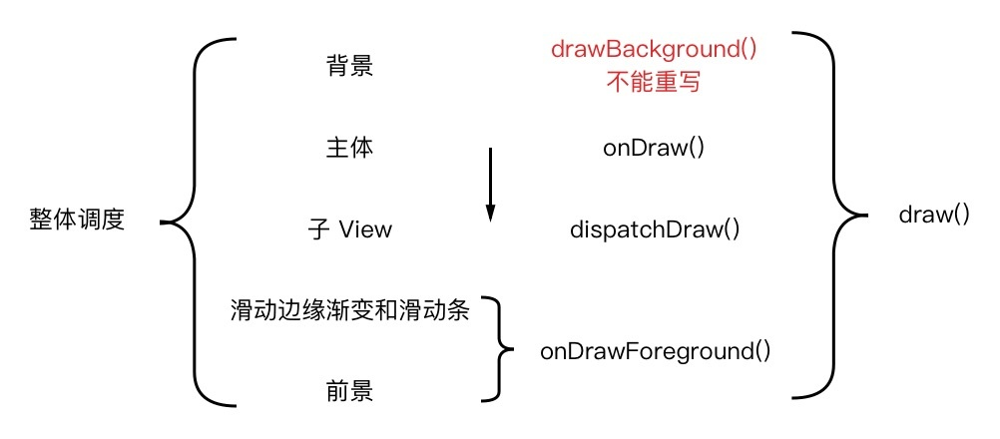

# DrawApp
HenCoder Android 开发进阶练习项目
[HenCoder](https://github.com/hencoder)

## 已完成
### [HenCoder Android 自定义 View 1-1 绘制基础](http://hencoder.com/ui-1-1/)

- [HenCoder 绘制 1 练习项目](https://github.com/hencoder/PracticeDraw1)


### [HenCoder Android 自定义 View 1-2 Paint 详解](http://hencoder.com/ui-1-2/)
- [HenCoder 绘制 2 练习项目](https://github.com/hencoder/PracticeDraw2)

### [HenCoder Android 自定义 View 1-3 文字的绘制](http://hencoder.com/ui-1-3/)
- [HenCoder 绘制 3 练习项目](https://github.com/hencoder/PracticeDraw3)

```text
笔记：
```

### [HenCoder Android 自定义 View 1-4 Canvas 对绘制的辅助 clipXXX() 和 Matrix](http://hencoder.com/ui-1-4/)
- [HenCoder 绘制 4 练习项目](https://github.com/hencoder/PracticeDraw4)

```text
笔记：
canvas.save()/canvas.restore()的作用
使用 Canvas 来做常见的二维变换（裁剪、移动、旋转...）
使用 Matrix 来做变换
使用 Camera 来做三维变换
```

### [HenCoder Android 自定义 View 1-5 绘制顺序](http://hencoder.com/ui-1-5/)
- [HenCoder 绘制 5 练习项目](https://github.com/hencoder/PracticeDraw5)

```
绘制流程
draw -> drawBackground(不能重写) -> onDraw -> dispatchDraw -> onDrawforeground

dispatchDraw : viewGroup 绘制子控件时调用
```



### [HenCoder Android 自定义 View 1-6：属性动画 Property Animation（上手篇）](http://hencoder.com/ui-1-6/)
- [HenCoder 绘制 6 练习项目](https://github.com/hencoder/PracticeDraw6)
